# Домашнее задание 2. Linux работа с памятью и процессами

## Задание 1. Systemd

### 1. Создать bash-скрипт сервиса /usr/local/bin/homework_service.sh

```
sudo nano /usr/local/bin/homework_service.sh
```

Результат:

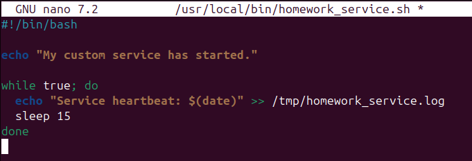

Сделаем его исполняемым:

```
sudo chmod +x /usr/local/bin/homework_service.sh
```

### 2. Создать systemd unit-файл для скрипта, который бы переживал любые обновления системы

```
sudo nano /etc/systemd/system/homework_service.service
```

Заполняем unit-файл:

```
[Unit]
Description=Homework service
After=network.target

[Service]
ExecStart=/usr/local/bin/homework_service.sh
Restart=always
RestartSec=15

[Install]
WantedBy=multi-user.target
```

Результат:

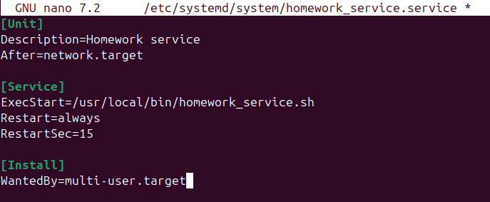

Пояснение:

- **Секция [Unit]**
  - **Description** - краткое описание сервиса
  - **After** - указывает, что сервис должен запускаться после завершения указанных юнитов
  (`network.target` - обеспечивает запуск после инициализации сети)

- **Секция [Service]**
  - **ExecStart** - скрипт, который запускается при старте сервиса.
  - **Restart** - политика перезапуска сервиса при его остановке или сбое
  (`always` - сервис перезапускается всегда, кроме случаев явной остановки через `systemctl stop`)
  - **RestartSec** - задержка в секундах перед перезапуском сервиса после сбоя
  (ожидание 15 секунд перед попыткой перезапуска)

- **Секция [Install]**
  - **WantedBy** - указывает таргет или таргеты, под которыми служба должна быть запущена
  (`multi-user.target` - сервис запускается в многопользовательском режиме (стандартный режим))

Перезагрузим демон systemd, чтобы он увидел новый unit:

```
sudo systemctl daemon-reload
```

### 3. Запустить сервис и убедиться, что он работает

Включим сервис для автозапуска при загрузке системы:

```
sudo systemctl enable homework_service.service
```

Запустим сервис:

```
sudo systemctl start homework_service.service
```

Проверим статус сервиса:

```
sudo systemctl status homework_service.service
```

Результат:

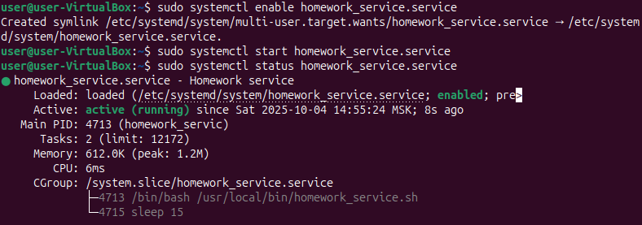

Для дополнительной проверки просмотрим лог-файл, записи в который добавляются каждые 15 секунд:

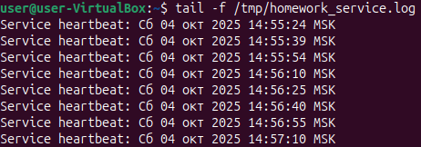

### 4. Убедиться, что сервис сам перезапускается в случае падения через 15 секунд

Остановим процесс вручную:

```
sudo pkill -f homework_service.sh
```

Через 15 секунд сервис должен перезапуститься автоматически. Проверим его статус снова:

```
sudo systemctl status homework_service.service
```

Результат:

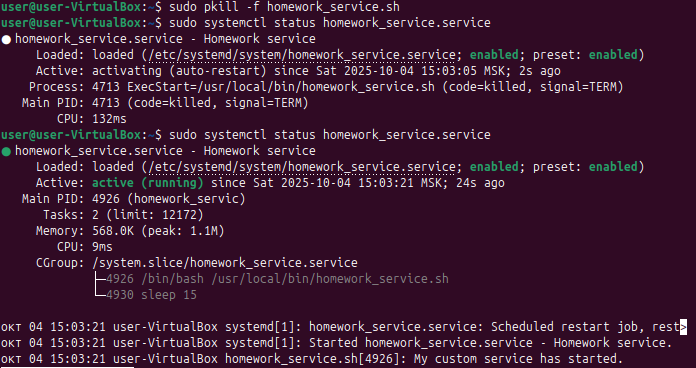

### 5. Показать топ-5 systemd unit'ов стартующих дольше всего, используя systemd-analyze

```
systemd-analyze blame | head -n 5
```

Результат:

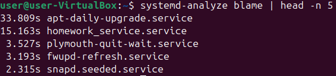

## Задание 2. Межпроцессное взаимодействие (IPC) с разделяемой памятью

### 1. Создать программу для работы с разделяемой памятью

Создадим файл `shm_creator.c`:

```
nano shm_creator.c
```

Результат:

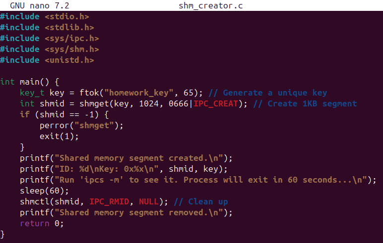

### 2. Скомпилировать и запустить

Скомпилируем программу:

```
gcc shm_creator.c -o shm_creator
```

Создадим файл для генерации ключа (необходим для функции `ftok` для генерации уникального ключа):

```
touch homework_key
```

Запустим программу:

```
./shm_creator
```

Результат:

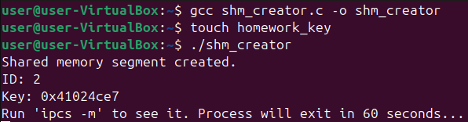

### 3. Проанализировать вывод запущенной программы

Пока программа запущена (60 секунд), в соседнем терминале выведем информацию об активных сегментах разделяемой памяти:

```
ipcs -m
```

Результат:

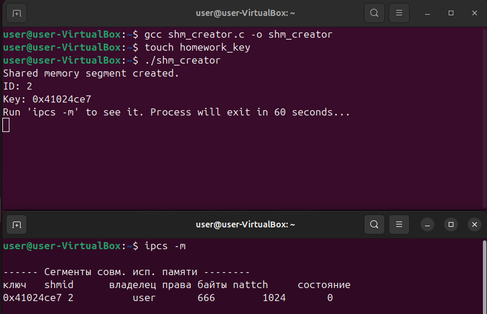

Анализ вывода:

- ключ - уникальный ключ, используется для идентификации сегмента между процессами
(генерируется с помощью `ftok` на основе файла homework_key и числа 65)
- shmid - идентификатор сегмента
- владелец - имя пользователя, создавшего сегмент (текущий пользователь)
- права - права доступа (текущее значение 666 - чтение/запись, было указано в качестве параметра в `shmget`)
- байты - размер сегмента (в байтах) (текущее значение 1024 байта - 1 Кб, было указано в качестве параметра в `shmget`)
- nattch - количество процессов, подключённых к этому сегменту памяти (текущее значение 0)
- состояние - информация о состоянии сегмента разделяемой памяти (пустое значение - сегмент создан и доступен)

В данном случае `nattch` равен 0, так как программа только создаёт сегмент с помощью функции `shmget`,
но не присоединяет его к адресному пространству процесса с помощью функции `shmat`.
То есть, если значение `nattch` > 0, это указывает на активное использование памяти несколькими процессами.

## Задание 3. Анализ памяти процессов (VSZ vs RSS)

### 1. Запустить python-скрипт

```
python3 -c "print('Allocating memory...'); a = 'X' * (250 * 1024 * 1024); import time; print('Memory allocated. Sleeping...'); time.sleep(120);"
```

Результат:

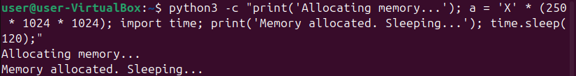

Пояснение:

Python-скрипт аллоцирует 250 MiB памяти и держит её 2 минуты

### 2. Найти PID запущенного python-скрипта и проанализировать использование RSS и VSZ

#### 2.1 Найдём PID запущенного python-скрипта:

```
ps aux | grep python3
```

Результат:

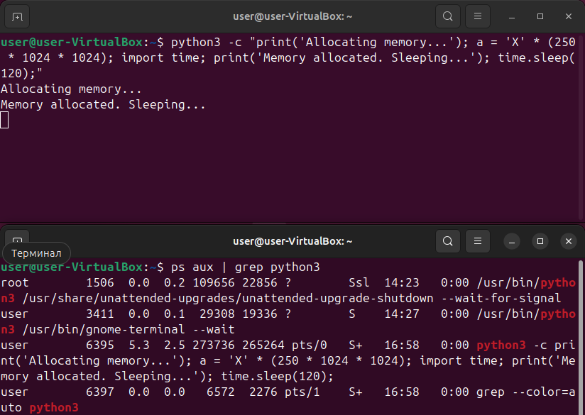

Пояснение:

PID запущенного python-скрипта равен 6395

#### 2.2 Проанализируем использование RSS и VSZ для найденного PID

```
ps -o pid,user,%mem,rss,vsz,comm -p 6395
```

Результат:

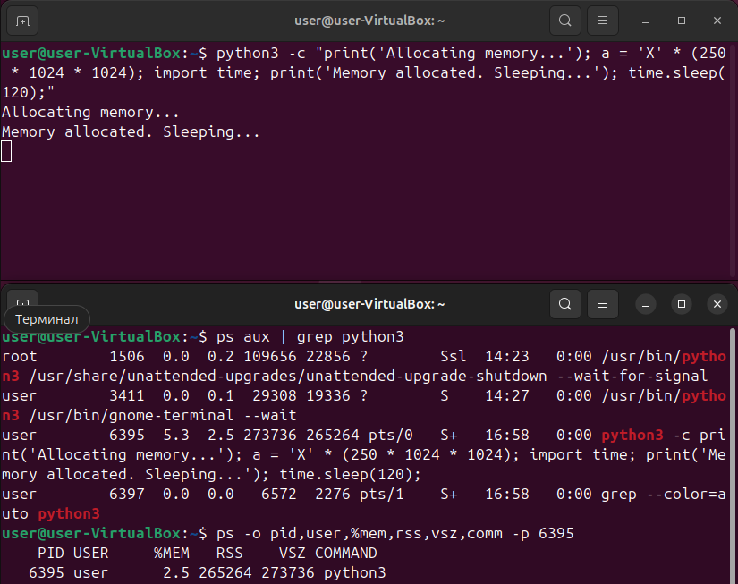

Пояснение:

- PID - идентификатор процесса (текущее значение - 6395)
- USER - пользователь, запустивший процесс (текущий пользователь)
- %MEM - процент используемой физической памяти (RSS) от общей RAM системы (текущее значение - 2.5%).
- RSS (Resident Set Size) - часть виртуальной памяти процесса, которая физически находится в RAM
(текущее значение 265264 KiB ≈ 272 MiB).
- VSZ (Virtual Memory Size) - общий размер виртуального адресного пространства процесса
(текущее значение ~273736 KiB ≈ 280 MiB).
- COMMAND - имя команды (текущее значение - python3).

VSZ больше RSS, так как VSZ включает в себя код программы, библиотеки, heap и стек,
то есть как реально используемую память, так и просто зарезервированную, но ещё не загруженную в RAM.

RSS не равен нулю, так как процесс действительно использует память.
Код интерпретатора, библиотеки и данные (в данном случае 250 MiB) занимают место в RAM.

## Задание 4. NUMA и cgroups

### 1. Продемонстрировать количество NUMA нод на вашем сервере и количество памяти для каждой NUMA ноды

```
numactl --hardware
```

Результат:

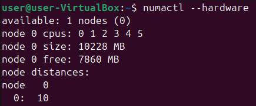

Пояснение:

На системе доступна одна NUMA-нода (node 0).
Она содержит 6 процессорных ядер (CPU 0-5) и около 10 GB оперативной памяти,
из которых в данный момент свободно примерно 7,7 GB. Поскольку система имеет только одну NUMA-ноду,
вся память доступна равномерно для всех процессоров, и разделения по зонам доступа (локальной/удалённой памяти) нет.

### 2. Убедиться в возможности ограничивать работу процессов при помощи systemd

```
sudo systemd-run --unit=highload-stress-test --slice=testing.slice \
--property="MemoryMax=150M" \
--property="CPUWeight=100" \
stress --cpu 1 --vm 1 --vm-bytes 300M --timeout 30s
```

Результат:

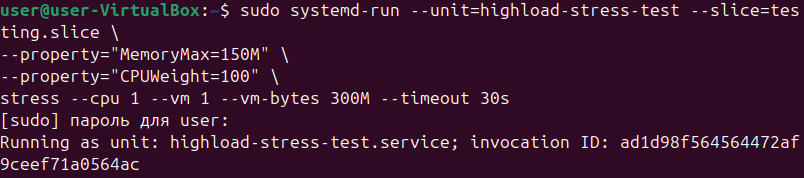


**Будет ли работать тест если мы запрашиваем 300М оперативной памяти, а ограничиваем 150М?**

Да, будет, если в системе включён swap (файл подкачки).
Если же swap отключить, процесс будет убит (OOM-killer) при попытке превысить лимит.

Проверим работу и завершение теста в журнале systemd:

```
journalctl -u highload-stress-test
```

Результат:

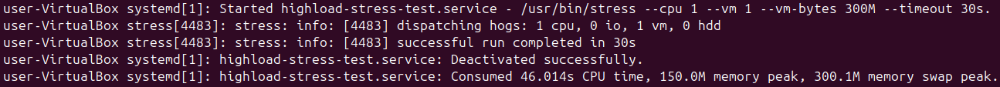

**Превысило ли использование памяти 150 МБ?**

Процесс не превысил лимит физической памяти. Пик физического использования составил 150.0M, то есть ровно столько, сколько было установлено ограничением MemoryMax=150M.
Однако, дополнительно использовалось около 300M подкачки (swap), что позволило процессу завершиться без ошибок.

**Что происходит с процессом при превышении?**

Когда процесс достигает лимита MemoryMax, он не может использовать больше физической оперативной памяти, чем указано.
Однако, если в системе включён swap, часть данных процесса выгружается в файл подкачки.
Таким образом, процесс продолжает работать, не нарушая ограничение по физической памяти.

Если подкачка отключена или исчерпана, то при попытке выделить память сверх лимита заданного MemoryMax,
OOM-killer принудительно завершит процессы в cgroup службы.

**Попробуем отключить swap и проверить результат выполнения теста:**

```
sudo swapoff -a
```

**Запустим тест и проверим его работу в журнале systemd:**

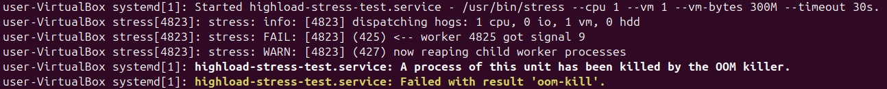

Пояснение:

При превышении лимита по оперативной памяти система не смогла выделить дополнительную память
и завершила процесс с помощью OOM-killer.

Запустим тест с параметром MemoryMax=350М и проверим его работу в журнале systemd:

```
sudo systemd-run --unit=highload-stress-test2 --slice=testing.slice \
--property="MemoryMax=350M" \
--property="CPUWeight=100" \
stress --cpu 1 --vm 1 --vm-bytes 300M --timeout 30s
```

Результат:

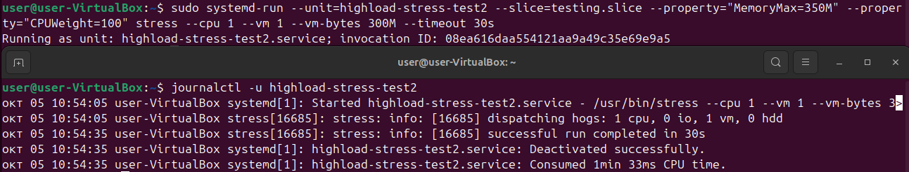

Пояснение:

При запуске теста с параметрами MemoryMax=350M и --vm-bytes=300M процесс завершился успешно, так как объём запрашиваемой памяти не превышал значение лимита

### 3. Описать что делает и для чего можно использовать MemoryMax and CPUWeight

**MemoryMax** - ограничивает максимальный объём оперативной памяти, доступный процессу.
При превышении лимита (и отключённом swap) процесс завершается с помощью OOM-killer.

**CPUWeight** - задаёт приоритет использования CPU (чем выше значение, тем больше доля процессорного времени).
Служба с CPUWeight=200 получить вдвое больше процессорного времени, чем служба с CPUWeight=100.

Оба параметра применяются для управления ресурсами и предотвращения перегрузки системы.